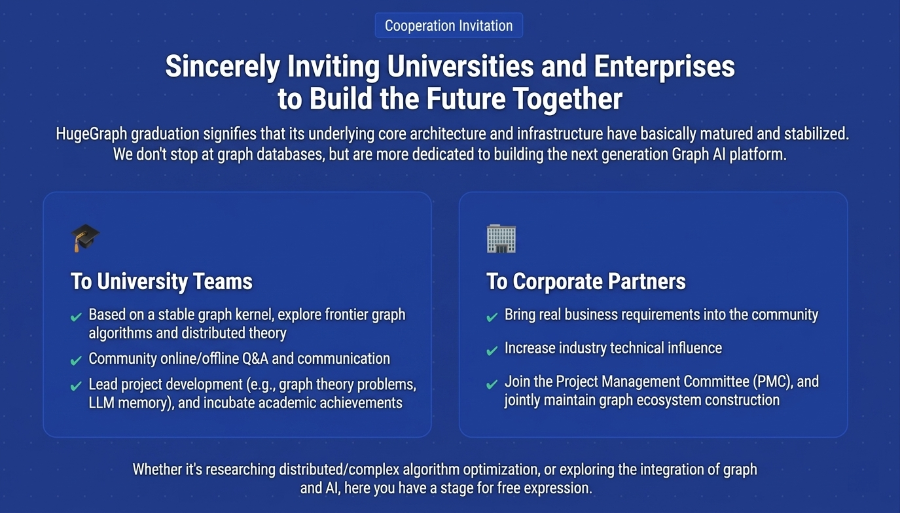

## Announcement

Recently, the Apache Software Foundation (ASF) officially announced that after four years of incubation and refinement, Apache HugeGraph has officially graduated and been promoted to a Top-Level Project (TLP)!

---

As the first open-source graph database / graph computing system in China, HugeGraph officially began its Apache incubation journey in January 2022. After four years of community collaboration and patient refinement, on January 12, 2026, the graduation vote in the Apache Incubator was passed unanimously with 18 +1 binding votes and 8 +1 non-binding votes[1][2]. On the subsequent February 12, ASF officially announced the graduation notice[3]. At this point, HugeGraph officially graduated from the incubator and became an Apache Top-Level Project.

Achieving this major milestone not only means that the project fully complies with "**The Apache Way**" in terms of trademark, copyright, LICENSE compliance, community governance, and diversity, but also represents HugeGraph fully entering a new chapter of maturity, stability, and large-scale use in enterprise core business.

## About Apache HugeGraph

`Apache HugeGraph` is an easy-to-use, high-performance full-stack graph system, covering core components such as [graph database](https://hugegraph.apache.org/docs/quickstart/hugegraph/hugegraph-server/), [graph computing](https://hugegraph.apache.org/docs/quickstart/computing/hugegraph-computer/), and [graph AI](https://hugegraph.apache.org/docs/quickstart/hugegraph-ai/). It supports [Gremlin](https://tinkerpop.apache.org/gremlin.html) and [Cypher](https://opencypher.org/) graph query languages, and provides complete tools for graph visualization, import, backup, and more, helping users easily build AI applications and products based on graph data.

It not only supports high-performance import of hundreds of billions of vertices and edges, and provides millisecond-level relational query capabilities, but also independently developed a distributed storage engine and in-memory computing framework, greatly improving the processing efficiency of massive relational data while ensuring high service availability.

Typical application scenarios of HugeGraph include deep path exploration, user profiling, knowledge graphs, community discovery, and LLM memory. Applicable business domains include attack tracing, financial risk control, social networks, and GraphRAG.

### Apache HugeGraph Core Features and Advantages

1. **Excellent horizontal scalability and high-performance read and write (Graph Database)**

   - Based on a **property graph** design, HugeGraph implements native **distributed HStore storage**, capable of accommodating **hundreds of billions of entities and relationships**. When facing high-frequency OLTP online queries, it can also maintain **millisecond-level ultra-fast read and write response**, breaking through the performance and scalability bottlenecks of traditional graph databases at massive data scale.

2. **Dual-engine driven OLAP (graph computing)**
   HugeGraph’s graph computing module implements a distributed dual-engine complement of “in-memory + out-of-core”:

- It has Vermeer, an in-memory computing engine developed in Go, designed for daily scenarios within tens of billions of data, near real-time analysis, extremely simple deployment, and built-in Web monitoring, with 20+ classic graph algorithms supported out of the box;
- It also has Computer, an in-memory and out-of-core combined engine that supports full graph computation at ultra-large scale (hundreds of billions), supports K8s elastic scaling and disk spilling, making HugeGraph’s full graph analysis truly achieve “not only able to compute at large scale, but also able to compute quickly”.

3. **Exploration of the Memory Layer of Agentic Graph (Graph AI)**

   - The **HugeGraph-AI** repository directly provides **GraphRAG (graph-based retrieval augmented generation)**, natural language to graph query (Text2GQL / Text2Gremlin), automated knowledge graph construction, and 20+ graph learning (GNN) algorithms. This deep integration provides large language models (LLMs) with rigorous topological context, **greatly improving the “hallucination” pain point of large models**, and lowering the engineering threshold for developers to build intelligent graph applications.
   - As the core engine of HugeGraph has matured, its ecosystem construction has also gradually improved. As the core of the ecosystem, HugeGraph-AI integrates vector search and knowledge graph technologies to build deep RAG application solutions. In order to respond to the rapid evolution of large language model (LLM) capabilities and the demands of complex reasoning, we have carried out a deep architectural refactor of HugeGraph-AI.

4. **Efficient Import and Visualization Toolchain (Toolchain)**

   - HugeGraph-Toolchain covers the complete graph technology toolchain ecosystem. It includes the **Loader** import tool, which supports high-performance online writing from multiple formats / multiple data sources, and is also compatible with mainstream relational databases, Kafka, and Flink CDC data sources. Combined with query capabilities and the Hubble visualization interface, users can more intuitively complete graph data import, modeling, and analysis.

5. **Graph Infrastructure (Overall Overview)**

   - The system supports standalone embedded / distributed clusters, and ensures **high availability and data consistency** through the Raft + RocksDB architecture. Combined with the graph computing engine and Graph AI module, it has been running stably in business systems such as **risk control / anti-fraud and real-time feature retrieval** at major internet companies / banks, and has undergone **long-term validation in industrial-grade scenarios**.

## From 2016 to 2026: HugeGraph’s Evolution Path

1. **Project Origin (2016 - 2021)**
   HugeGraph was born in 2016 and was initially independently developed by Baidu to solve the data analysis pain points in complex pan-security scenarios. Before being donated to the Apache Foundation, it was the first open-source graph database on GitHub in China. After several years of community refinement, multiple early versions such as 0.5 to 0.12 were released during this period (by the end of 2021).

2. **Entering the Apache Incubator (2022)**
   On January 23, 2022, HugeGraph, as a high-performance scalable graph database + graph computing engine, officially entered the Apache Software Foundation (ASF) incubator, beginning its global open-source journey toward community diversity + university participation.

3. **Incubation Iteration and Ecosystem Expansion (2023 - 2025)**
   During incubation, the HugeGraph community maintained steady major version iteration, completing the transformation from a single graph database into a “**full-stack graph system**”:

   - **Version 1.0.0 (February 22, 2023)**: This was the **first official Apache release version** after entering the incubator. This release was contributed to by 30+ contributors with more than 270 pull requests, added 16+ graph algorithms, and comprehensively upgraded the overall technology stack; it also officially released the new Computer repository for graph computing OLAP computation engine, replacing Spark GraphX and supporting full graph computation for billions to hundreds of billions of graph data.
   - **Version 1.2.0 (December 28, 2023)**: Introduced slow query recording / visual documentation, several major performance improvements in core storage + computing, added big data Spark ecosystem support, and merged multiple toolchain components into the toolchain repository for unified management.
   - **Version 1.3.0 (April 1, 2024)**: Added the HugeGraph-AI repository and released its first official version, including the python client and modules such as graph extraction / GNN; greatly improved the Docker deployment experience and provided OpenTelemetry distributed tracing support.
   - **Version 1.5.0 (December 10, 2024)**: As production data volume exceeded hundreds of billions, the previously used `Cassandra/HBase/TiKV` storage layers encountered many performance and maintenance bottlenecks. After two years of refinement, the community released **HStore**, a distributed storage foundation implemented based on `Raft + RocksDB`; it also greatly improved the LLM submodule in the AI repository, supporting lightweight GraphRAG, Text2GQL, and 21 graph machine learning algorithms for practical deployment.
   - **Version 1.7.0 (November 28, 2025)**: Released a new in-memory graph computing engine Vermeer module for small and medium-scale computing scenarios; the computing layer added **in-heap / out-of-heap memory management modules**. This module implements pooled allocation of out-of-heap memory, attempting to solve the industry challenge of OOM in complex graph queries; the Graph AI module, through operator refactoring and the adoption of a brand-new C++ scheduling framework, makes the new architecture more flexible in adapting to the development of Agentic Graph[4].

## Open Source Story

### 1. Diversified Development

Before joining the Apache Foundation, the HugeGraph community mainly had participation from domestic contributors, and most developers were from the same company, making diversity relatively limited. After joining ASF, many overseas and contributors from different organizations began to emerge, bringing more opportunities for communication and collaboration with other communities, and helping the project embrace the "Community Over Code" culture. 

However, we also recognize that building a truly global and diverse open-source community is an ongoing process. We still welcome and encourage more contributors from different countries, backgrounds, and organizations to join and participate in shaping the future of HugeGraph together.

In addition, besides supporting common Flink/Spark/Hadoop ecosystems, we have also actively collaborated with other open-source communities.

- HugeGraph has been integrated as a connector into Apache SeaTunnel and Apache TinkerPop; it has introduced Apache Fory for serialization and off-heap memory management; and actively promotes support for Apache GraphAR graph binary format.
- We also maintain good technical cooperation with open-source projects such as RocksDB / ToplingDB (storage engines), CGraph (graph orchestration), and JRaft (consensus algorithm). We not only use these open-source technologies, but also actively give back to these communities through submitting PRs and providing technical feedback.

### 2. University x Open Source Journey

Since joining Apache incubation, HugeGraph has, for many consecutive years, been selected as an organization project for **GSoC (Google Summer of Code) and OSPP / GLCC** (Open Source Summer / CCF). Dozens of university students from around the world have gained rich open source experience and generous rewards by participating in the development of core functional modules.

Among them, some students with outstanding contributions and deeper accumulation were later nominated as Apache Committers and even became members of the PMC (project core), and also obtained opportunities such as internships at major companies. In the articles that follow, we will gradually update the related experiences and sharing of these students, so that each student can show their own style.

### 3. Users and Adoption

As a project that has undergone long-term refinement, HugeGraph has been running stably in production environments of many leading internet companies and financial institutions, including well-known technology and financial enterprises such as BAT, Huolala, CVTE, and ICBC, all of which are real users. At the beginning of 2026, the main code repository surpassed 3000+ stars on GitHub. The entire ecosystem has gathered more than 210+ contributors, with developers and users widely distributed across 50+ companies such as Tencent, Baidu, CVTE, Huolala, 360, NetEase Games, ByteDance, as well as major universities both domestically and internationally. External contributors account for more than 90% of code commits, truly achieving a healthy evolution from a single entity → community-driven model.

Since introducing HugeGraph into risk control scenarios in 2021, the graph data model has been applied throughout the full lifecycle of risk control, supporting real-time online queries within P99 latency of hundreds of milliseconds, meeting the high-performance requirements of real-time anti-fraud. Congratulations to HugeGraph on its successful graduation!

—— **Yang Jiaqi**, HugeGraph Committer, Big Data Architect at Huolala

Congratulations to HugeGraph on officially becoming an Apache Top-Level Project! Graph technology faces many new challenges in the era of large models, but it has also been infused with new vitality. The HugeGraph community keeps pace with technological trends, bringing many innovative ideas and implementations to both the underlying graph infrastructure and upper-level intelligent graph applications. Currently, HugeGraph has deep applications in many scenarios such as manufacturing, quality, and education at CVTE. Looking forward to jointly exploring more valuable application scenarios and interesting technical breakthroughs in the future.

—— **Zhang Shiming**, HugeGraph PMC Member, Researcher at CVTE

## Reshaping Graph Infrastructure

With the resurgence of AI + Graph in current trends, when we discuss the development of “future graph technology”, what should we focus on?

For teams facing technology selection and preparing to migrate from traditional closed-source or open-source standalone graph databases (such as Neo4j), choosing HugeGraph is often about solving real problems in graph scenarios. While paying tribute to predecessors, we have chosen a gradual path from adaptation → self-developed distributed architecture for massive graph data:

- **Strong horizontal scalability**: Early graph systems were mostly based on standalone or in-memory architectures. When business vertex and edge data reaches tens of billions or even hundreds of billions, relying on vertical scaling (adding memory or disks) easily hits physical limits. HugeGraph, from its early multi-storage backend support to the latest distributed **HStore**, enables easy horizontal elastic scaling like building blocks, stably handling high-frequency concurrent read and write pressure.

- **Embracing AI capabilities**: In the wave of LLMs, HugeGraph chooses to **provide native AI integration capabilities**. The independent hugegraph-ai module not only integrates 21 graph learning algorithms, but also supports **MCP + GraphRAG**, directly providing precise graph context for large models and improving hallucination issues.

- **Low migration barrier**: HugeGraph provides a high-performance data import tool loader, which can seamlessly connect to multiple data sources such as local files, HDFS, Kafka, and Flink CDC. It also supports the SeaTunnel connector for convenient data transformation ecosystem reuse and expansion. At the same time, it **supports both Gremlin and Cypher query languages**, making it easy for existing graph users to migrate smoothly.

- **Fully open and neutral**: In the industry, enterprise-level features such as high availability, visualization, and cluster management are often restricted to “enterprise editions” or are not fully open source. As an **Apache Top-Level Project**, HugeGraph maintains 100% open source across the full stack from “graph storage → graph computing → graph visualization / toolchain → graph AI”, allowing users to avoid ecosystem lock-in concerns.

## Setting Sail for the Future, Opening a New Chapter of Co-construction

After years of refinement and four years of Apache incubation, HugeGraph’s core graph storage and graph computing engines, along with its distributed foundation, have become relatively stable and reliable, and have undergone “long-term validation” in real-world scenarios across major internet companies and universities. Graduation from the foundation also marks the beginning of a new phase of exploration.

The stability of the foundation means that the curtain for upper-layer innovation has officially been raised. We firmly believe that the future of graphs lies in “Graph + AI” and “large-scale complex computation”. Therefore, we extend an invitation for deep collaboration to universities, research teams, laboratories, and enterprise developers:

1. **For universities and laboratories (top-tier research and cutting-edge work):** If you lack an industrial-grade data foundation to validate your graph algorithms or Graph + LLM ideas, HugeGraph provides an out-of-the-box graph data platform. We warmly welcome academic teams to conduct research based on HugeGraph, and even lead the further evolution of core modules such as HugeGraph-AI and memory management. On the platform of an Apache Top-Level Project, your research outcomes will directly reach thousands of enterprise users worldwide, enabling not only high-quality academic publications (such as `VLDB/SIGMOD`), but also leaving your mark in the open-source world of Apache.

2. **For enterprises and individual developers (lead development, open and neutral):** HugeGraph does not belong to any commercial company. It is a fully open-source project driven 100% by the Apache Foundation and its community. The project is currently in a transition phase from a “distributed graph system” to an “intelligent graph service”. By joining the community, you do not need to design a graph system from scratch. You can build upon existing work, directly lead the development of core features, and quickly grow into an Apache Committer or even a PMC member, contributing to shaping the future of next-generation graph technology.

In addition, the community will continue to deepen the integration of graph and AI ecosystems, strengthen the distributed capabilities of the graph engine, and further promote the combination of graph and LLM to provide stronger support for Agentic evolution.

### Acknowledgements and Thanks

Every step forward of the community is inseparable from the collective efforts of developers around the world. Whether it is **submitting code**, **reporting issues**, **contributing documentation**, or **participating in discussions**, all have been crucial to HugeGraph’s successful promotion to a Top-Level Project.

Here, we would like to express our special thanks to all community members who have participated in HugeGraph’s architectural refactoring, code contributions, documentation translation, and issue feedback. Special thanks to the ASF mentor team of the project, all IPMC/PPMC members who participated or provided suggestions, and all Committers and Contributors who have long supported the community by answering questions and providing guidance. (The figure below shows the complete list of GitHub contributors during the incubation period.)

*In addition to community contributions, we also sincerely thank Baidu, as the donating company, for providing an open environment for the project’s growth[5]. We would like to give special thanks to Mr. Ma Hongwei from OSPO for his strong support and careful guidance; to Mr. Bao Chenfu from TC and the OSPP/GLCC organizers for their steadfast support of open-source technology and ecosystem; and to team members such as Liu Jie, Han Zuli, Zhang Yi, Li Yulin, and Ji Shilei who have contributed to the project. Finally, we thank everyone who participated in documentation writing/modification, project releases, and all friends who have followed and supported the project’s development. Due to space limitations, we cannot name everyone individually, but every contribution is remembered. On the open-source journey, thank you for walking alongside us!*

## Messages

### Messages from Apache Mentors

---

As an Apache HugeGraph incubation mentor, I am very pleased to witness HugeGraph successfully graduate from the Apache Incubator and become a top-level project. I wish Apache HugeGraph continued development and greater achievements in the future, relying on an open, diverse, and collaborative community!

—— **Jiang Ning**, ASF Member, ASF PPMC, ASF Board Member (2022–2024)

---

Warm congratulations to HugeGraph on successfully graduating from the Apache Incubator and becoming an Apache Top-Level Project! This is not only a milestone, but also a recognition of community governance, engineering quality, and long-term sustainability. Thanks to every contributor for their persistence and professionalism, and also to user partners for their real feedback and co-construction.

We hope HugeGraph will continue to adhere to openness and transparency, community-first principles, attract more global developers to participate, and make graph storage and computing capabilities more stable, easier to use, and more reliable. The future is promising.

—— **Dai Lidong**, ASF Member, Apache SeaTunnel & DolphinScheduler PMC, CTO of White Whale Open Source Technology

---

Warm congratulations to Apache HugeGraph on successfully completing incubation and officially becoming an Apache Top-Level Project! This milestone achievement is not only the result of years of collaborative community governance, but also fully demonstrates the recognition of Chinese original technology and governance capabilities by the international open source foundation.

We look forward to HugeGraph taking this as a new starting point, continuously expanding its technical influence, attracting more diverse contributors to participate, deepening collaboration and integration with other Apache projects, and working together with the global community to maintain open, transparent, and sustainable open source infrastructure, contributing greater value to industry innovation.

—— **Li Yu**, ASF Member, Head of Alibaba Cloud EMR & Milvus, Apache HugeGraph Incubator Mentor

---

Congratulations to Apache HugeGraph on graduating as a top-level project. Well done to everyone involved and look forward to its new chapter ahead!

—— **Pan Juan**, ASF Member, Apache HugeGraph Incubator Mentor

---

After solid development, Apache HugeGraph has formed a stable and vibrant international open source community. It has not only received extensive attention and adoption from the industry, but has also attracted many students from our universities to voluntarily join the community.

We look forward to Apache HugeGraph, as an international top-level open source project, continuing to grow and bringing top-tier large-scale graph database technology and experience to the industry.

—— **Huang Xiangdong**, Associate Researcher, School of Software, Tsinghua University, ASF Member, Apache IoTDB PMC Chair

---

Congratulations to HugeGraph on becoming an Apache Top-Level Project. A top-level project is not the end, but the beginning of long-termism: writing trust into code, writing consensus into processes, and writing responsibility into time. May HugeGraph take user value as its anchor and community collaboration as its sail, moving forward more steadily and shining brighter.

—— **Guo Wei**, ASF Member, CEO of White Whale Open Source

---

Warm congratulations to Apache HugeGraph on completing incubation and being promoted to an Apache Top-Level Project!

As the former head of open source at Baidu, I personally witnessed the early growth of HugeGraph within Baidu, and also witnessed its journey from being donated to the Apache Foundation to its final graduation.

Along the way, what makes me most gratified and proud is that today’s PMC members are no longer limited to within Baidu, but have truly included developers from different companies. This transformation of crossing organizational boundaries and achieving true community autonomy is the foundation for the long-term vitality of open source projects.

Thanks to all contributors who participated in the project, especially to the PPMC members and mentors for their professional guidance and dedication during the incubation period.

Graduation is a new starting point. May HugeGraph continue to uphold its original spirit of openness and move forward steadily on the stage of world-class graph databases!

—— **Tan Zhongyi**, Former Head of Open Source at Baidu, ASF Member, Apache bRPC PMC Member

---

### Messages from the Industry

---

Congratulations to HugeGraph on officially being promoted to an Apache Top-Level Project! As the first open-source graph database / graph system in China, HugeGraph has, during nearly three years of incubation, rooted itself in mainstream fields such as graph computing, big data, and AI, creating its own value.

Working closely with the community and universities, exploring new approaches, cultivating newcomers, and growing together with the next generation. I am honored to have had the opportunity to collaborate with the HugeGraph team, learning from each other through teaching and practice. Wishing HugeGraph continuous iteration and optimization, better implementation, and empowerment of the industry ecosystem.

—— **Chunel Feng**, Founder of the open-source project CGraph

---

Upon learning that Apache HugeGraph has officially graduated from the Apache Incubator and become a Top-Level Project (TLP), as a PPMC member of Apache GeaFlow (Incubating), I would like to extend the most sincere congratulations to HugeGraph on behalf of the Apache GeaFlow community 🎉!

The graduation of HugeGraph not only demonstrates the core graph technologies of high-performance graph databases, but also brings confidence to the entire graph open source ecosystem. At the same time, I believe that in the AI era, graphs can bring more possibilities to AI. I hope to have the opportunity to engage in in-depth exchanges with the HugeGraph community and jointly promote the implementation of graph domain and Graph + AI applications. Once again, congratulations to HugeGraph on its successful graduation!

—— **Zhou Qiang**, Apache GeaFlow PPMC / Core Author

---

Congratulations to Apache HugeGraph on successfully graduating from the incubator and becoming an Apache Top-Level Project! As an important open-source project in the field of graph technology, HugeGraph has made impressive progress in technical capabilities, product evolution, and community development, fully demonstrating the development potential of high-quality open-source infrastructure software.

Since incubation, the project has continuously iterated, and the community has grown steadily, always adhering to the Apache culture of open collaboration and community governance. Today’s graduation is an important milestone and also the beginning of a new journey. We look forward to HugeGraph continuously improving its ecosystem and expanding its influence after becoming a top-level project, creating value for more developers and enterprise users worldwide.

—— **Yang Chaokun**, Apache Fory PMC Chair

---

Congratulations to HugeGraph on successfully graduating from the Apache Incubator! Graph systems are important infrastructure for understanding complex relational data and are playing an increasingly important role in scenarios such as knowledge graphs, risk control analysis, and intelligent applications.

By providing high-performance graph storage and query capabilities under a distributed architecture, HugeGraph offers a reliable platform for processing massive relational data. It is great to see HugeGraph continuously improving its technical system and building an active open-source community during incubation. Wishing the project continued growth and broader impact in the field of graph data technology in the future!

—— **Bao Chenfu**, Distinguished Architect at Baidu

---

Congratulations to Apache HugeGraph on officially graduating and becoming the 5th Top-Level Project (TLP) donated by Baidu to Apache. As a high-performance and easy-to-use open-source graph system, it has already achieved large-scale application and deployment in production scenarios such as financial risk control, social networks, and cybersecurity.

This successful graduation is not only a full recognition of HugeGraph’s technical maturity, engineering stability, and community governance capabilities, but also marks the continued substantive progress of Baidu and Chinese open-source projects in the global graph technology ecosystem. We look forward to HugeGraph continuing to collaborate with the global developer community in the future, promoting the deep integration of graph technology and AI technology, and providing stable and reliable open-source infrastructure for more complex data relationship analysis and decision-making scenarios in the intelligent era.

—— **Zang Zhi**, Director of Engineering Efficiency Department at Baidu, Head of OSPO

---

### Get Involved in HugeGraph

> If you are interested in graph technology / AI / distributed systems / databases, or would like to contribute to the open source community, you are very welcome to join us!

- **Contribute code**: Visit the [HugeGraph GitHub repository](https://github.com/apache/hugegraph), take the first step by submitting a PR, and participate in the development of graph system features.
- **Report issues and improvement suggestions**: Submit an [Issue](https://github.com/apache/hugegraph/issues) on GitHub to help us identify problems and improve performance.
- **Contribute documentation and tutorials**: Any improvements in documentation will have a positive impact on community members. You are welcome to help with documentation translation, formatting, and more.

**HugeGraph** looks forward to more developers, enterprises, and students joining. Let’s work together to advance graph technology and explore the infinite possibilities of graph data.

## References

1. https://lists.apache.org/thread/djkxttgpj08v74r8rqdv3np856g3krlr  
   *(vote process)*

2. https://lists.apache.org/thread/1717m9n576mvvndhzhcjph0n8z10xjn5  
   *(vote result)*

3. https://news.apache.org/foundation/entry/the-apache-software-foundation-announces-new-top-level-project-3

4. https://hugegraph.apache.org/blog/2025/10/29/agentic-graphrag/

5. [Unanimous approval! China’s first open-source graph database HugeGraph successfully enters the Apache Incubator](https://mp.weixin.qq.com/s?__biz=MzU5ODY4OTgyNg==&mid=2247483964&idx=1&sn=59d2afebbbccd1715c27ffe4bb03bb0d&scene=21#wechat_redirect)